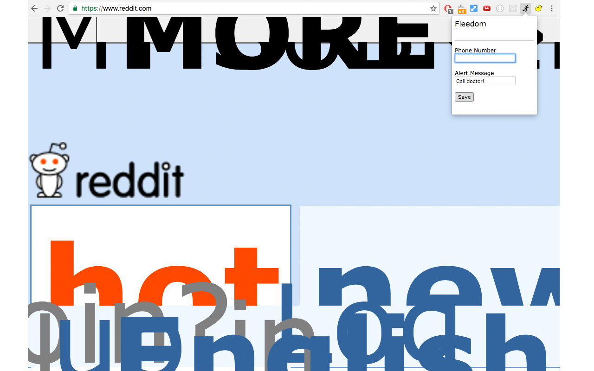

# Fleedom

## Background

Have you ever had a moment where you're busy working on the computer, but a co-worker, supposed-friend, or roommate decides to start a full-fledged conversation with you?  It can be hard to get them to leave you alone without coming across as rude.  However, this Chrome extension solves such dicey social situations by providing a number of options to get you back to work (or play) in no time.

Fleedom can generate a number of seemingly innocent excuses through hotkey assignment, allowing you to covertly execute whichever one best fits the situation, which will provide you a socially acceptable reason to cut short the conversation without discomfort.  

## Functionality & MVP

This extension allows users to:

  - Send a text to their phone.
  - Sound a slightly delayed (to avoid suspicion) reminder alarm on their computer.
  - Distort all the tabs on the current window enough to warrant an urgent call to "tech support".
  - Use hotkeys to activate these features.
  - Save data via popup button.

## Screenshots

The displayed webpage is using the distort feature, and the popup shows where the phone number and alert message can be viewed, updated, and saved.

## Strategies and Workings

As with all Chrome extensions, Fleedom relies heavily upon HTML, CSS, and JavaScript technology, while also using a spot of jQuery in order to facilitate an AJAX request.

Surprisingly, the most intensive part of this project was learning how to correctly use the internal Chrome APIs like 'storage', 'notifications', and 'tabs'.  While not difficult to conceptualize, the Chrome API syntax documentation tends to encourage experimentation.  So after much trial and error, Fleedom now uses 3 internal Chrome APIs.

The Storage API is used to store the phone number and alert message.  The stored data is used to fill the text fields in the popup when it is opened, so the text fields allow you to view the saved data as well as overwrite it.  This data is used internally to supply the phone number for the AJAX call to the Textbelt API in order to send a phone a text, and also to fill in the message for the fake alert/reminder functionality.

The Notifications API is used to replicate a fake Google notification with previously stored data.  The audio alert accompanying the notification was taken from Google's countdown timer and pauses/resets when the fake notification is dismissed.

The Tabs API is used to gather an array of all the tab IDs for the current window, to which destructive styling is applied upon activation of the fake error feature.  This styling is achieved by overwriting each respective tab's CSS with JavaScript code.

While Fleedom was initially designed to hold various files containing the code for each action, the fact that each action needed to be constantly listening for its respective hotkey, along with the relatively small amount of code that each action required (approximately 30 lines each), made it preferable to store all hotkey-related code in the background.js file, which constantly runs in the background and listens for hotkeys.

## Future Plans

Fleedom's texting feature is limited by the Textbelt API, which means that adding additional functionality would likely be impossible.  However, the alert functionality could be further customizable.  For instance, users could specify how long the delay is between hotkey activation and alert appearance.

The fake error functionality could be improved in a number of ways, most importantly it could be adjusted to be toggle-able so that even opening new tabs would result in the same error behavior, which would likely convince even the most persistent target.  Also, the CSS modifications could be customizable so that users could adjust what happens to their tabs when an "error" is simulated.
